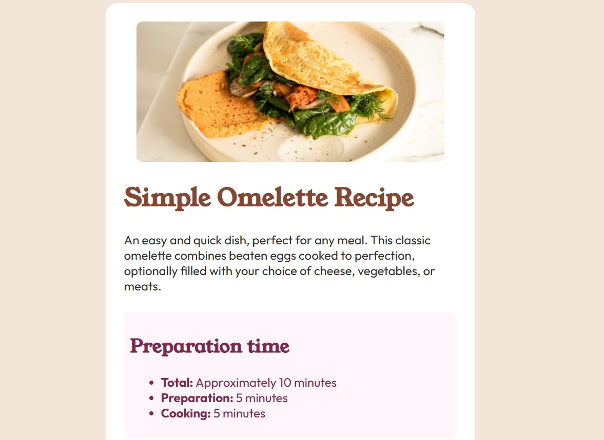
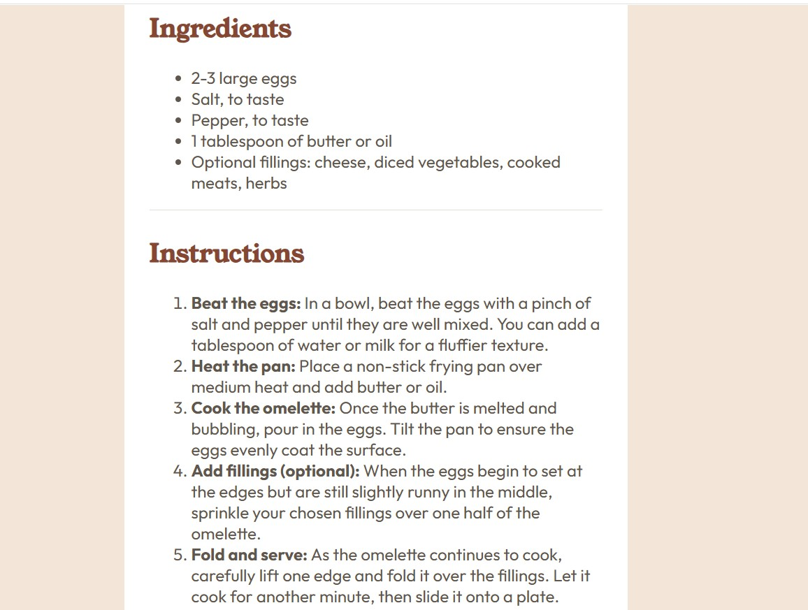
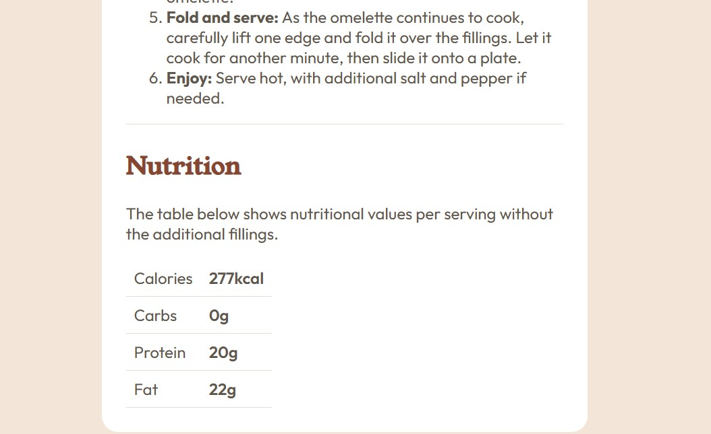

# Frontend Mentor - Recipe page solution

This is a solution to the [Recipe page challenge on Frontend Mentor](https://www.frontendmentor.io/challenges/recipe-page-KiTsR8QQKm). Frontend Mentor challenges help you improve your coding skills by building realistic projects. 

## Table of contents

- [Overview](#overview)
  - [The challenge](#the-challenge)
  - [Screenshot](#screenshot)
  - [Links](#links)
- [My process](#my-process)
  - [Built with](#built-with)
  - [What I learned](#what-i-learned)

## Overview

### The Challenge

Build a responsive recipe page that closely matches the provided design on both mobile and desktop. Focus on using semantic HTML and modern CSS techniques like Flexbox and CSS variables to create a clean, accessible layout.

### Screenshot

### Links

- [Solution URL](https://github.com/nikkiBubencik/recipe-page-main)
- [Live Site URL](https://nikkibubencik.github.io/recipe-page-main/)

## My process

### Built with

- Semantic HTML5 markup
- CSS custom properties
- Flexbox
- Mobile-first workflow

### What I learned

While building this project, I practiced working with semantic HTML and improved my understanding of structuring content clearly. I also gained more confidence using CSS custom properties to keep my styles organized and consistent throughout the page.